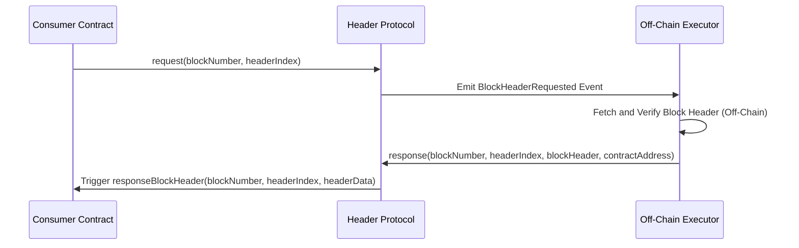

# **HeaderProtocol**: On-Chain Block Header Service

<div style="text-align:center" align="center">
    
</div>

---

Header Protocol is a smart contract system that allows other contracts to request and retrieve specific fields from Ethereum block headers. This is achieved in a secure, efficient, and trustless manner, enabling advanced use cases like on-chain randomness, gas price games, and historical data retrieval.

With Header Protocol, you can request both **free tasks** (no fees) and **paid tasks** (with fees to incentivize completion). Executors (off-chain agents) listen for requests, fetch the block header data from the blockchain, and provide it back to the protocol for on-chain validation.

---

## Table of Contents

1. [Features](#features)
2. [How It Works](#how-it-works)
3. [Block Header Indexes](#block-header-indexes)
4. [Task Types](#task-types)
   - [Free Tasks](#free-tasks)
   - [Paid Tasks](#paid-tasks)
5. [Key Functions](#key-functions)
6. [Examples](#examples)
7. [Diagrams](#diagrams)

---

## Features

- **Secure Access to Block Headers:** Retrieve specific block header fields such as `baseFeePerGas`, `mixHash`, `timestamp`, `miner`, and more.
- **Free or Paid Tasks:** Choose between free tasks (emit events) and paid tasks (store fees for executor rewards).
- **Long-Term Accessibility:** Use the `commit` function to preserve block hashes beyond Ethereum’s 256-block limitation.
- **Error Handling and Refunds:** Built-in mechanisms to refund fees for incomplete tasks.
- **Versatile Applications:** Ideal for randomness, gas price prediction, analytics, and more.

---

## How It Works

Header Protocol operates in three key phases:

1. **Request Phase:**

   - A contract requests specific block header data by calling `request(blockNumber, headerIndex)`.
   - The task is either free or paid, depending on whether `msg.value` is provided.

2. **Execution Phase:**

   - Executors listen for `BlockHeaderRequested` events.
   - They fetch the block header from the Ethereum blockchain off-chain and call `response(...)` to provide the data.

3. **Validation Phase:**
   - The protocol validates the block header data on-chain using the `blockhash` function.
   - Upon successful validation:
     - Free tasks trigger the `responseBlockHeader` callback.
     - Paid tasks transfer the fee reward to the executor and trigger the callback.

---

## Block Header Indexes

| **Index** | **Field Name**          | **Type**   | **Description**                                            |
| --------- | ----------------------- | ---------- | ---------------------------------------------------------- |
| 0         | `parentHash`            | `bytes32`  | Hash of the parent block.                                  |
| 1         | `sha3Uncles`            | `bytes32`  | Hash of the uncles' list.                                  |
| 2         | `miner`                 | `address`  | Address of the block miner.                                |
| 3         | `stateRoot`             | `bytes32`  | State root hash of the block.                              |
| 4         | `transactionsRoot`      | `bytes32`  | Root hash of the block's transactions.                     |
| 5         | `receiptsRoot`          | `bytes32`  | Root hash of the block's receipts.                         |
| \_        | `logsBloom`             | `bytes256` | Logs bloom filter for the block (not retrievable onchain). |
| 7         | `difficulty`            | `uint256`  | Difficulty level of the block.                             |
| 8         | `number`                | `uint256`  | Block number.                                              |
| 9         | `gasLimit`              | `uint256`  | Gas limit for the block.                                   |
| 10        | `gasUsed`               | `uint256`  | Gas used by the block.                                     |
| 11        | `timestamp`             | `uint256`  | Timestamp of the block.                                    |
| \_        | `extraData`             | `bytes`    | Extra data field of the block (not retrievable onchain).   |
| 13        | `mixHash`               | `bytes32`  | Mix hash used for proof-of-work.                           |
| 14        | `nonce`                 | `uint64`   | Nonce used for mining the block.                           |
| 15        | `baseFeePerGas`         | `uint256`  | Base fee per gas unit for the block (EIP-1559).            |
| 16        | `withdrawalsRoot`       | `bytes32`  | Withdrawals root for beacon chain withdrawals.             |
| 17        | `blobGasUsed`           | `uint256`  | Blob gas used in the block.                                |
| 18        | `excessBlobGas`         | `uint256`  | Excess blob gas in the block.                              |
| 19        | `parentBeaconBlockRoot` | `bytes32`  | Parent beacon block root hash.                             |

---

## Task Types

### Free Tasks

Free tasks emit an event and do not store any fee. They rely on altruistic executors.

**Requesting a Free Task:**

```solidity
protocol.request(blockNumber, headerIndex); // no msg.value
```

### Paid Tasks

Paid tasks lock Ether as a reward for whoever responds first with the correct header data.

**Requesting a Paid Task:**

```solidity
protocol.request{value: 1 ether}(blockNumber, headerIndex);
```

---

## Key Functions

### **Request Header Data**

```solidity
function request(uint256 blockNumber, uint256 headerIndex) external payable;
```

### **Provide Response**

```solidity
function response(uint256 blockNumber, uint256 headerIndex, bytes calldata blockHeader, address contractAddress) external;
```

### **Commit Blockhash**

```solidity
function commit(uint256 blockNumber) external;
```

### **Refund Fees**

```solidity
function refund(uint256 blockNumber, uint256 headerIndex) external;
```

### **Get Header**

```solidity
function getHeader(uint256 blockNumber, uint256 headerIndex) external view returns (bytes32);
```

### **Get Hash**

```solidity
function getHash(uint256 blockNumber) external view returns (bytes32);
```

---

## Examples

### Full Free Example

```solidity
import {IHeaderProtocol, IHeader} from "@headerprotocol/contracts/v1/interfaces/IHeaderProtocol.sol";

contract MyContract is IHeader {
   IHeaderProtocol private protocol;

   // blockNumber => headerIndex => headerData
   mapping(uint256 => mapping(uint256 => bytes32)) public headers;

   constructor(address _protocol) {
      protocol = IHeaderProtocol(_protocol);
   }

   function myRequest(uint256 blockNumber, uint256 headerIndex) external {
      protocol.request(blockNumber, headerIndex);
   }

   // required implementation of IHeader
   function responseBlockHeader(
      uint256 blockNumber,
      uint256 headerIndex,
      bytes32 headerData
   ) external {
      require(msg.sender == address(protocol), "Only Header Protocol");
      headers[blockNumber][headerIndex] = headerData; // 30,000 gas limit, only save
   }
}
```

### Full Paid Example

```solidity
import {IHeaderProtocol, IHeader} from "@headerprotocol/contracts/v1/interfaces/IHeaderProtocol.sol";

contract MyContract is IHeader {
   IHeaderProtocol private protocol;

   // blockNumber => headerIndex => headerData
   mapping(uint256 => mapping(uint256 => bytes32)) public headers;

   constructor(address _protocol) {
      protocol = IHeaderProtocol(_protocol);
   }

   function myRequest(uint256 blockNumber, uint256 headerIndex) external payable {
      protocol.request{value: msg.value}(blockNumber, headerIndex);
   }

   function myCommit(uint256 blockNumber) external {
      protocol.commit(blockNumber);
   }

   function myRefund(uint256 blockNumber, uint256 headerIndex) external {
      protocol.refund(blockNumber, headerIndex);
   }

   // required implementation of IHeader
   function responseBlockHeader(
      uint256 blockNumber,
      uint256 headerIndex,
      bytes32 headerData
   ) external {
      require(msg.sender == address(protocol), "Only Header Protocol");
      headers[blockNumber][headerIndex] = headerData; // 30,000 gas limit, only save
   }

   receive() external payable {} // accept refunds
}
```

---

## Diagrams


