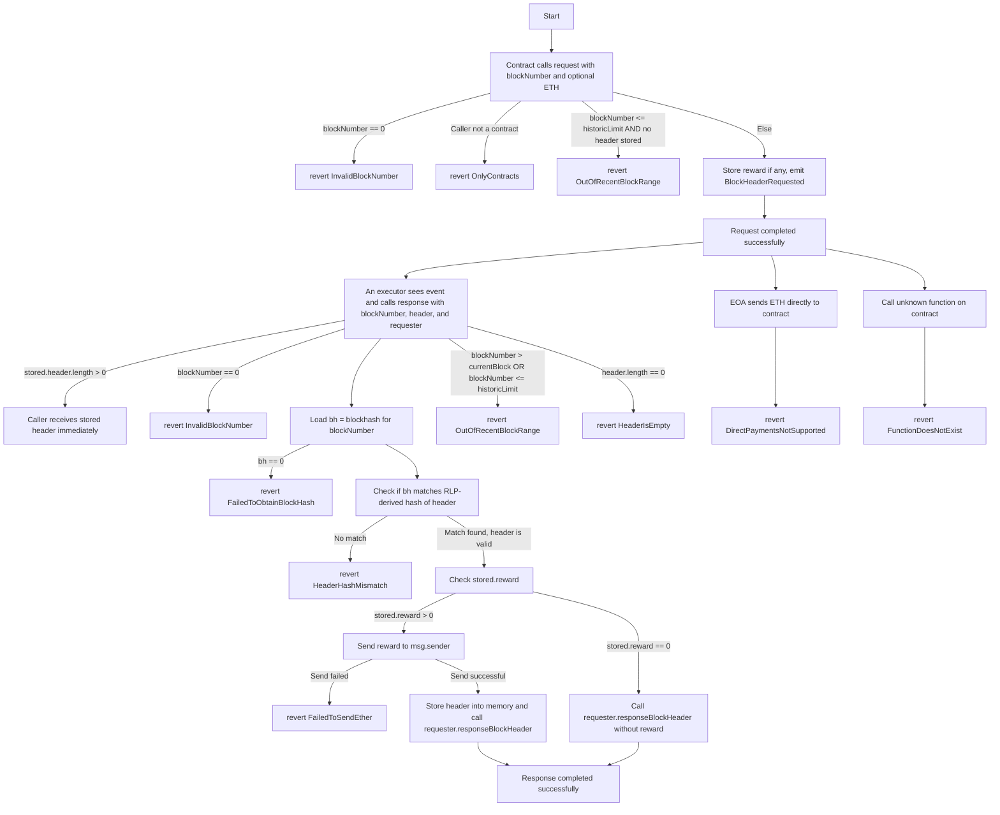

# Header Protocol



### Overview

`HeaderProtocol` is a Solidity smart contract that enables other contracts to request and receive verified Ethereum block headers. Contracts can request headers for a given block number, optionally offering a reward in Ether to any responder who provides a valid header. The protocol ensures that the provided header matches the `blockhash` of that block, ensuring its authenticity.

### Key Features

- **Secure Header Verification:**  
  The contract uses `blockhash` to verify the authenticity of provided block headers.
- **Open Incentivized System:**  
  Requesters can offer Ether rewards. Anyone observing the request on-chain can provide a valid header to claim the reward, encouraging a decentralized ecosystem of providers.
- **Immediate Retrieval of Stored Headers:**  
  If a header is already stored (from a previous response), the contract immediately returns it to new requesters at no cost. This saves gas and reduces latency for frequently requested headers.

### How It Works

1. **Requesting a Header:**
   - A contract calls `request(blockNumber)` to request a block header.
   - If it sends Ether with the call, that Ether becomes the reward.
   - An event `BlockHeaderRequested` is emitted, signaling off-chain watchers that a request is available.
2. **Responding with a Header:**
   - A provider calls `response(blockNumber, header, requester)`.
   - The contract verifies:
     - The block number is valid.
     - The provided header matches `blockhash(blockNumber)`.
   - If verification succeeds, the responder:
     - If a reward was offered, receives the Ether reward.
     - The contract calls `responseBlockHeader(blockNumber, header)` on the requester’s contract, supplying the verified header.
3. **Pre-Verified Headers:**
   - If a previously rewarded header for the same block exists in storage, new requesters can receive it immediately without additional verification or payment.

### Security Considerations

- **Reentrancy Protection:**  
  The `nonReentrant` modifier ensures that calls to `response` cannot be re-entered, protecting against complex exploit attempts.
- **Caller Validation:**  
  The `request` function requires the caller to be a contract, preventing accidental or malicious requests from externally owned accounts that don't implement the expected callback interface.
- **Block Number and Range Checks:**  
  Requests and responses for very old blocks (older than the last 256 blocks) are disallowed unless a header is already stored. This prevents referencing a `blockhash` that the EVM no longer retains, ensuring reliable verification.
- **Fail-Fast Conditions:**  
  The contract uses custom errors (or revert strings) for clear, gas-efficient error handling. Invalid states are promptly rejected.

### Gas Efficiency

- Minimal state is stored. Headers are only stored when a reward is offered and a header is successfully provided.
- Requests without rewards do not write to storage, ensuring lower gas costs.
- Re-using stored headers saves gas on repeated requests.

### Best Practices Followed

- **Checked arithmetic:**  
  Potential underflows avoided by carefully handling `block.number < 256` cases.
- **No Unnecessary Functions:**  
  Unused interface support checks have been removed.
- **Clear and Minimal Code:**  
  Improved naming, documentation, and error messages help maintain clarity and reduce complexity.
- **Limited External Calls:**  
  Only calls `responseBlockHeader` on the requester’s contract and uses `msg.sender.call` for reward payout, minimized interaction complexity.

### Integration Guide

**Install:**

- `forge install headerprotocol/headerprotocol`

````

**For Requesters (Consumers):**

1. **Implement the `IHeader` interface** in your contract to handle the callback:
   ```solidity
   import {IHeader} from "@headerprotocol/contracts/v1/interfaces/IHeader.sol";
   import {IHeaderProtocol} from "@headerprotocol/contracts/v1/interfaces/IHeaderProtocol.sol";

   contract MyConsumer is IHeader {
       function responseBlockHeader(uint256 blockNumber, bytes calldata header) external override {
           // Process the returned header
       }
   }
````

2. **Requesting a Header:**

   ```solidity
   import {IHeader} from "@headerprotocol/contracts/v1/interfaces/IHeader.sol";
   import {IHeaderProtocol} from "@headerprotocol/contracts/v1/interfaces/IHeaderProtocol.sol";

   contract MyConsumer is IHeader {
      // ...

      function requestBlockHeader(uint256 blockNumber) external override {
          // Suppose headerProtocol is at known address
          IHeaderProtocol headerProtocol = IHeaderProtocol(headerProtocolAddress);
          headerProtocol.request{value: 1 ether}(blockNumber);
          // Offering 1 ether reward (optionally)
      }
   }
   ```

3. **Receiving a Callback:**
   - When a valid header is supplied, `responseBlockHeader` is called on your contract with the verified header data.

**For Responders (Providers):**

1. **Observing Requests:**
   - Monitor `BlockHeaderRequested` events off-chain.
   - If a request is profitable or interesting, fetch the block header off-chain.
2. **Provide a Valid Header:**
   ```solidity
   headerProtocol.response(blockNumber, headerData, requesterAddress);
   ```
   - If verified, you earn the reward.

### Testing

- **Unit Tests with Foundry:**  
  The contract is designed to be tested with Foundry (`forge test`). Tests should include scenarios for:
  - Requesting headers with/without rewards.
  - Providing valid/invalid headers.
  - Receiving immediate headers if previously stored.
  - Verifying that old, unretrievable headers revert appropriately.
  - Testing edge cases such as `blockNumber = 0`, fallback calls, and direct Ether transfers.

### Future Improvements

- **Extended Block Verification:**  
  Could integrate light-client verification or external oracles for blocks older than 256 blocks.
- **Custom Incentive Structures:**  
  Allow multiple requests for the same block to accumulate rewards, encouraging quicker responses.

---

**This `HeaderProtocol` implementation, combined with clear testing and thorough documentation, provides a secure, maintainable, and transparent way to request and verify EVM block headers on-chain.**
