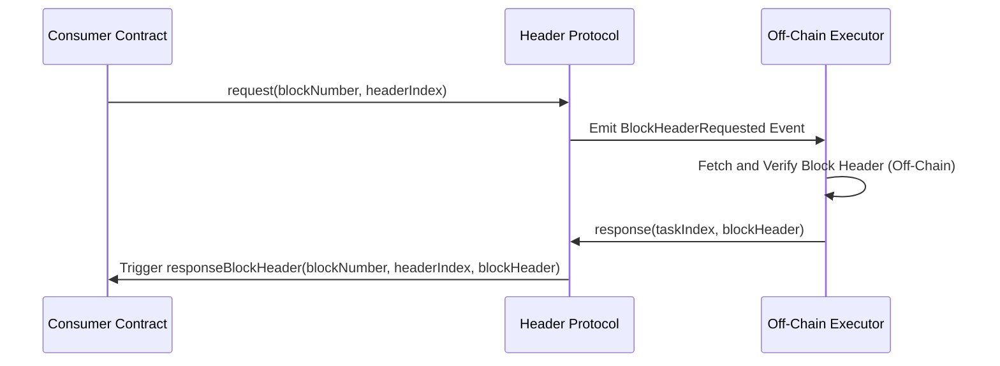

# **Header Protocol**: On-Chain Block Header Service

<div style="text-align:center" align="center">
    
</div>

---

Header Protocol is a smart contract system that allows other contracts to request and retrieve specific fields from Ethereum block headers. This is achieved in a secure, efficient, and trustless manner, enabling advanced use cases like on-chain randomness, gas price games, and historical data retrieval.

With Header Protocol, you can request both **free tasks** (no fees) and **paid tasks** (with fees to incentivize completion). Executors (off-chain agents) listen for requests, fetch the block header data from the blockchain, and provide it back to the protocol for on-chain validation.

---

## Table of Contents

1. [Features](#features)
2. [How It Works](#how-it-works)
3. [Block Header Indexes](#block-header-indexes)
4. [Task Types](#task-types)
   - [Free Tasks](#free-tasks)
   - [Paid Tasks](#paid-tasks)
5. [Key Functions](#key-functions)
6. [Examples](#examples)
7. [Diagrams](#diagrams)
8. [Security and Best Practices](#security-and-best-practices)

---

## Features

- **Secure Access to Block Headers:** Retrieve specific block header fields such as `baseFeePerGas`, `mixHash`, `timestamp`, `miner`, and more.
- **Free or Paid Tasks:** Choose between free tasks (emit events) and paid tasks (store fees for executor rewards).
- **Long-Term Accessibility:** Use the `commit` function to preserve block hashes beyond Ethereum’s 256-block limitation.
- **Error Handling and Refunds:** Built-in mechanisms to refund fees for incomplete tasks.
- **Versatile Applications:** Ideal for randomness, gas price prediction, analytics, and more.

---

## How It Works

Header Protocol operates in three key phases:

1. **Request Phase:**

   - A contract requests specific block header data by calling `request(blockNumber, headerIndex)`.
   - The task is either free or paid, depending on whether `msg.value` is provided.

2. **Execution Phase:**

   - Executors listen for `BlockHeaderRequested` events.
   - They fetch the block header from the Ethereum blockchain off-chain and call `response(...)` to provide the data.

3. **Validation Phase:**
   - The protocol validates the block header data on-chain using the `blockhash` function.
   - Upon successful validation:
     - Free tasks trigger the `responseBlockHeader` callback.
     - Paid tasks additionally transfer the fee reward to the executor.

---

## Block Header Indexes

Block headers contain an array of fields. Each field corresponds to an index, as shown below:

| **Index** | **Field Name**          | **Type**   | **Description**                                         |
| --------- | ----------------------- | ---------- | ------------------------------------------------------- |
| 0         | `parentHash`            | `bytes32`  | Hash of the parent block.                               |
| 1         | `sha3Uncles`            | `bytes32`  | Hash of the uncles' list.                               |
| 2         | `miner`                 | `address`  | Address of the block miner.                             |
| 3         | `stateRoot`             | `bytes32`  | State root hash of the block.                           |
| 4         | `transactionsRoot`      | `bytes32`  | Root hash of the block's transactions.                  |
| 5         | `receiptsRoot`          | `bytes32`  | Root hash of the block's receipts.                      |
| \_        | `logsBloom`             | `bytes256` | Logs bloom filter for the block (can't get onchain).    |
| 7         | `difficulty`            | `uint256`  | Difficulty level of the block.                          |
| 8         | `number`                | `uint256`  | Block number.                                           |
| 9         | `gasLimit`              | `uint256`  | Gas limit for the block.                                |
| 10        | `gasUsed`               | `uint256`  | Gas used by the block.                                  |
| 11        | `timestamp`             | `uint256`  | Timestamp of the block.                                 |
| \_        | `extraData`             | `bytes`    | Extra data field of the block (can't get onchain).      |
| 13        | `mixHash`               | `bytes32`  | Mix hash used for proof-of-work.                        |
| 14        | `nonce`                 | `uint64`   | Nonce used for mining the block.                        |
| 15        | `baseFeePerGas`         | `uint256`  | Base fee per gas unit for the block (EIP-1559).         |
| 16        | `withdrawalsRoot`       | `bytes32`  | Withdrawals root for withdrawals from the beacon chain. |
| 17        | `blobGasUsed`           | `uint256`  | Blob gas used in the block.                             |
| 18        | `excessBlobGas`         | `uint256`  | Excess blob gas in the block.                           |
| 19        | `parentBeaconBlockRoot` | `bytes32`  | Parent beacon block root hash.                          |

---

## Task Types

### Free Tasks

Free tasks allow contracts to request block header data without paying any fees. These tasks emit a `BlockHeaderRequested` event, which executors can monitor and voluntarily complete.

#### Requesting a Free Task

```solidity
protocol.request(blockNumber, headerIndex);
```

- No Ether (`msg.value`) is required.
- Executors voluntarily provide the requested data, receiving no compensation.

#### Example Callback

The `responseBlockHeader` function is triggered with the requested data:

```solidity
function responseBlockHeader(uint256 blockNumber, uint256 headerIndex, bytes32 headerData) external {
   // Use the received header data
   headers[blockNumber][headerIndex] = headerData;
}
```

---

### Paid Tasks

Paid tasks lock a fee (`msg.value`) in the protocol, incentivizing executors to complete the task promptly.

#### Requesting a Paid Task

```solidity
uint256 taskIndex = protocol.request{value: 1 ether}(blockNumber, headerIndex);
```

- Specify the `blockNumber` and `headerIndex` to request.
- `msg.value` determines the fee locked for the task.

#### Executor Reward

Upon successful completion, the executor receives the fee locked for the task.

---

## Key Functions

### Request Header Data

```solidity
function request(uint256 blockNumber, uint256 headerIndex) external payable returns (uint256 taskIndex);
```

- `blockNumber`: The block for which the header is requested.
- `headerIndex`: The index of the required header field.
- Returns a `taskIndex` for paid tasks.

---

### Provide Free Response

```solidity
function response(address contractAddress, uint256 blockNumber, uint256 headerIndex,, bytes calldata blockHeader) external;
```

- `contractAddress`: Address of the contract that requested the data.
- Called by executors to provide the requested header data.
- Validates the header on-chain.

### Provide Paid Response

```solidity
function response(uint256 taskIndex, bytes calldata blockHeader) external;
```

- Called by executors to provide the requested header data.
- Validates the header on-chain.

---

### Commit Blockhash

```solidity
function commit(uint256 blockNumber) external;
```

- Stores the blockhash on-chain to extend accessibility beyond 256 blocks.

---

### Refund Fees

```solidity
function refund(uint256 taskIndex) external;
```

- Returns the locked fee for tasks that remain incomplete after 256 blocks.

---

## Examples

#### Full Free Example

```solidity
import {IHeaderProtocol, IHeader} from "@headerprotocol/contracts/v1/interfaces/IHeaderProtocol.sol";

contract MyContract is IHeader {
   IHeaderProtocol private protocol;
   // blockNumber => headerIndex => headerData
   mapping(uint256 => mapping(uint256 => bytes32)) public headers;

   constructor(address _protocol) {
      protocol = IHeaderProtocol(_protocol);
   }

   function myRequest(
      uint256 blockNumber,
      uint256 headerIndex
   ) external payable {
      protocol.request(blockNumber, headerIndex);
   }

   // Implementation IHeader.responseBlockHeader
   function responseBlockHeader(
      uint256 blockNumber,
      uint256 headerIndex,
      bytes32 headerData
   ) external {
      require(address(protocol) == msg.sender, "Only Header Protocol");
      headers[blockNumber][headerIndex] = headerData; // gas limit is 30,000, save only.
   }
}
```

#### Full Paid Example

```solidity
import {IHeaderProtocol, IHeader} from "@headerprotocol/contracts/v1/interfaces/IHeaderProtocol.sol";

contract MyContract is IHeader {
   IHeaderProtocol private protocol;
   // blockNumber => headerIndex => headerData
   mapping(uint256 => mapping(uint256 => bytes32)) public headers;

   event Task(uint256 taskIndex);

   constructor(address _protocol) {
      protocol = IHeaderProtocol(_protocol);
   }

   function myRequest(
      uint256 blockNumber,
      uint256 headerIndex
   ) external payable {
      uint256 taskIndex = protocol.request{value: msg.value}(blockNumber, headerIndex);
      emit Task(taskIndex);
   }

   function myCommit(
      uint256 blockNumber
   ) external payable {
      protocol.commit(blockNumber); // blockNumber >= block.number - 256
   }

   // Implementation IHeader.responseBlockHeader
   function responseBlockHeader(
      uint256 blockNumber,
      uint256 headerIndex,
      bytes32 headerData
   ) external {
      require(address(protocol) == msg.sender, "Only Header Protocol");
      headers[blockNumber][headerIndex] = headerData; // gas limit is 30,000, save only.
   }

   function myRefund(
      uint256 taskIndex
   ) external payable {
      if (protocol.isRefundable(taskIndex)) {
         protocol.refund(taskIndex);
      }
   }

   receive() external payable {} // for a refund
}
```

---

## Diagrams

### Interaction Flow



---

## Security and Best Practices

1. **Gas Limits:** Ensure your `responseBlockHeader` implementation is efficient (≤30,000 gas).
2. **Blockhash Expiry:** Use the `commit` function for tasks involving future blocks to prevent expiry issues.
3. **Avoid Re-Entrancy:** The protocol uses `ReentrancyGuard`, but additional checks in your contract are recommended.
4. **Use Free Tasks for Simple Data:** Free tasks are ideal for non-critical requests where executor compensation isn't needed.
