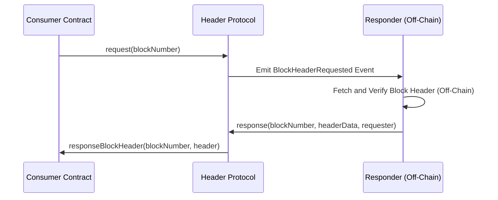
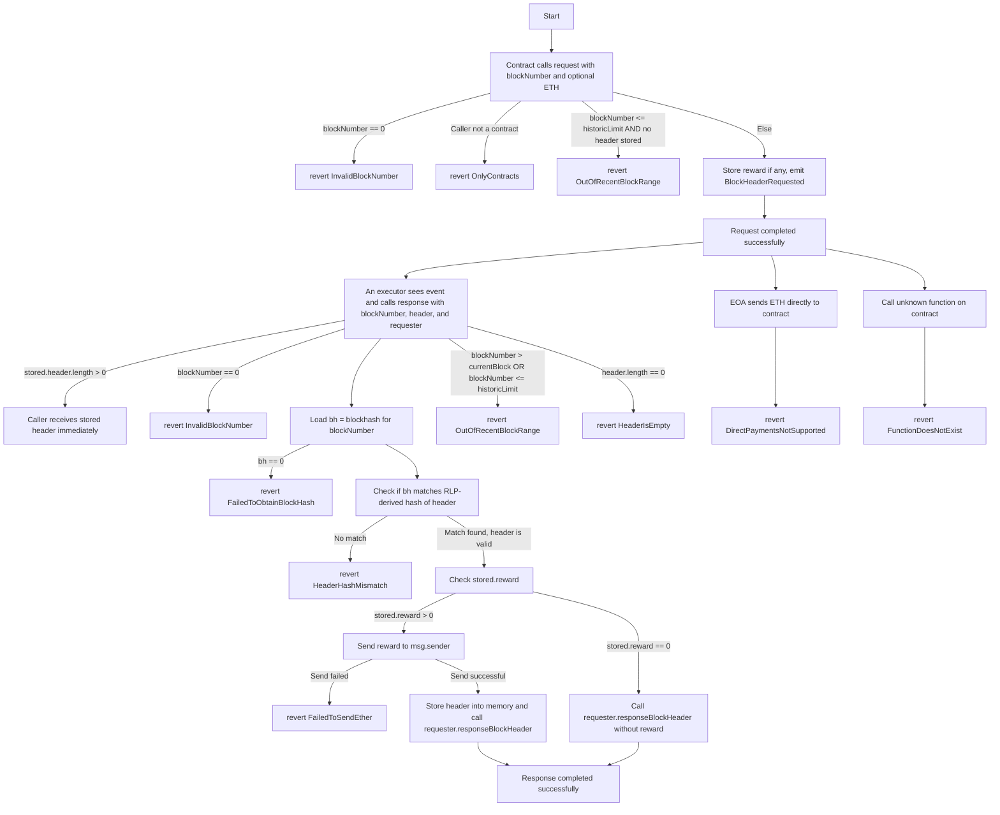

# Header Protocol

<div style="text-align:center" align="center">
    
</div>

### Overview

`HeaderProtocol` is a Solidity smart contract that enables other contracts to request and receive verified Ethereum block headers. Contracts can request headers for a given block number, optionally offering a reward in Ether to any responder who provides a valid header. The protocol ensures that the provided header matches the `blockhash` of that block, ensuring its authenticity.



### Key Features

- **Secure Header Verification:**  
  The contract uses `blockhash` to verify the authenticity of provided block headers.
- **Open Incentivized System:**  
  Requesters can offer Ether rewards. Anyone observing the request on-chain can provide a valid header to claim the reward, encouraging a decentralized ecosystem of providers.
- **Immediate Retrieval of Stored Headers:**  
  If a header is already stored (from a previous response), the contract immediately returns it to new requesters at no cost. This saves gas and reduces latency for frequently requested headers.

### How It Works

1. **Requesting a Header:**
   - A contract calls `request(blockNumber)` to request a block header.
   - If it sends Ether with the call, that Ether becomes the reward.
   - An event `BlockHeaderRequested` is emitted, signaling off-chain watchers that a request is available.
2. **Responding with a Header:**
   - A provider calls `response(blockNumber, header, requester)`.
   - The contract verifies:
     - The block number is valid.
     - The provided header matches `blockhash(blockNumber)`.
   - If verification succeeds, the responder:
     - If a reward was offered, receives the Ether reward.
     - The contract calls `responseBlockHeader(blockNumber, header)` on the requester’s contract, supplying the verified header.
3. **Pre-Verified Headers:**
   - If a previously rewarded header for the same block exists in storage, new requesters can receive it immediately without additional verification or payment.

### Security Considerations

- **Reentrancy Protection:**  
  The `nonReentrant` modifier ensures that calls to `response` cannot be re-entered, protecting against complex exploit attempts.
- **Caller Validation:**  
  The `request` function requires the caller to be a contract, preventing accidental or malicious requests from externally owned accounts that don't implement the expected callback interface.
- **Block Number and Range Checks:**  
  Requests and responses for very old blocks (older than the last 256 blocks) are disallowed unless a header is already stored. This prevents referencing a `blockhash` that the EVM no longer retains, ensuring reliable verification.
- **Fail-Fast Conditions:**  
  The contract uses custom errors (or revert strings) for clear, gas-efficient error handling. Invalid states are promptly rejected.

### Gas Efficiency

- Minimal state is stored. Headers are only stored when a reward is offered and a header is successfully provided.
- Requests without rewards do not write to storage, ensuring lower gas costs.
- Re-using stored headers saves gas on repeated requests.

### Best Practices Followed

- **Checked arithmetic:**  
  Potential underflows avoided by carefully handling `block.number < 256` cases.
- **No Unnecessary Functions:**  
  Unused interface support checks have been removed.
- **Clear and Minimal Code:**  
  Improved naming, documentation, and error messages help maintain clarity and reduce complexity.
- **Limited External Calls:**  
  Only calls `responseBlockHeader` on the requester’s contract and uses `msg.sender.call` for reward payout, minimized interaction complexity.

### Integration Guide

#### Installation

To integrate the Header Protocol, install the package using Foundry:

```bash
forge install headerprotocol/headerprotocol
```

#### How It Works

1. **Requesting a Block Header**:  
   The consumer (requester) contract sends a request to the Header Protocol for a specific block header, optionally offering a reward.

2. **Monitoring Requests**:  
   Off-chain responders (providers) monitor the `BlockHeaderRequested` events emitted by the protocol.

3. **Providing the Header**:  
   Responders fetch the requested header off-chain, verify it, and then submit the valid header back to the protocol.

4. **Receiving a Callback**:  
   Once the header is verified, the protocol calls the requester’s `responseBlockHeader` function with the header data.

#### Flow Diagram



#### For Requesters (Consumers)

##### Step 1: Request a Block Header

Use the `IHeaderProtocol` interface to send a request for a block header. You can optionally include a reward in Ether to incentivize responders.

```solidity
import {IHeaderProtocol} from "@headerprotocol/contracts/v1/interfaces/IHeaderProtocol.sol";
import {IHeader} from "@headerprotocol/contracts/v1/interfaces/IHeader.sol";
import {RLPReader} from "@headerprotocol/contracts/v1/utils/RLPReader.sol";

contract MyConsumer is IHeader {
    using RLPReader for RLPReader.RLPItem;
    using RLPReader for RLPReader.Iterator;
    using RLPReader for bytes;

    address public headerProtocolAddress = address(0); // Set this to the known Header Protocol address
    mapping(uint256 => uint256) public fee; // Block Number => Base Fee Per Gas

    // Request a block header
    function requestBlockHeader(uint256 blockNumber) external {
        IHeaderProtocol headerProtocol = IHeaderProtocol(headerProtocolAddress);
        headerProtocol.request{value: 1 ether}(blockNumber); // Optional: 1 ether reward
    }

    // Callback function to handle the response
    function responseBlockHeader(uint256 blockNumber, bytes calldata header) external override {
      RLPReader.RLPItem memory item = header.toRlpItem();
      RLPReader.Iterator memory iterator = item.iterator();
      for (uint256 i = 0; i < 15; i++) {iterator.next();}
      if (fee[blockNumber] == 0) fee[blockNumber] = iterator.next().toUint(); // baseFeePerGas
    }
}
```

##### Step 2: Receive the Header via Callback

When a valid header is provided by a responder, the Header Protocol will call the `responseBlockHeader` function in your contract. Ensure proper validation and processing of the header data.

```solidity
function responseBlockHeader(uint256 blockNumber, bytes calldata header) external override {
    // Process the returned header data (e.g., store it, verify it, etc.)
}
```

#### For Responders (Providers)

##### Step 1: Monitor Header Requests

Responders should observe the `BlockHeaderRequested` events emitted by the protocol to identify new requests. Use tools like web3.js, ethers.js, or TheGraph for efficient event monitoring.

##### Step 2: Fetch and Verify the Header

Off-chain, fetch the requested block header using a blockchain node or service. Ensure the data is valid and meets the request's criteria.

##### Step 3: Submit the Valid Header

Responders submit the fetched and verified header to the protocol using the `response` function. If the header is valid, the protocol will transfer the reward to the responder.

```solidity
headerProtocol.response(blockNumber, headerData, requesterAddress);
```

#### Summary of Key Functions

| **Role**      | **Function**                                                                         | **Description**                                                              |
| ------------- | ------------------------------------------------------------------------------------ | ---------------------------------------------------------------------------- |
| **Requester** | `request(uint256 blockNumber)`                                                       | Sends a block header request to the protocol with an optional reward.        |
| **Requester** | `responseBlockHeader(uint256 blockNumber, bytes calldata header)`                    | Callback function triggered when a valid header is provided.                 |
| **Responder** | `response(uint256 blockNumber, bytes calldata headerData, address requesterAddress)` | Submits the requested header to the protocol to earn the reward if verified. |

#### Notes

- **Reward**: Offering a reward in `requestBlockHeader` is optional but encourages faster responses.
- **Security**: Validate header data in `responseBlockHeader` to avoid processing malicious input.
- **Monitoring Tools**: Use reliable tools for off-chain event monitoring to efficiently identify profitable requests.

### Testing

- **Unit Tests with Foundry:**
  The contract is designed to be tested with Foundry (`forge test`). Tests should include scenarios for:
  - Requesting headers with/without rewards.
  - Providing valid/invalid headers.
  - Receiving immediate headers if previously stored.
  - Verifying that old, unretrievable headers revert appropriately.
  - Testing edge cases such as `blockNumber = 0`, fallback calls, and direct Ether transfers.

### Future Improvements

- **Extended Block Verification:**
  Could integrate light-client verification or external oracles for blocks older than 256 blocks.
- **Custom Incentive Structures:**
  Allow multiple requests for the same block to accumulate rewards, encouraging quicker responses.

---

**This `HeaderProtocol` implementation, combined with clear testing and thorough documentation, provides a secure, maintainable, and transparent way to request and verify EVM block headers on-chain.**
